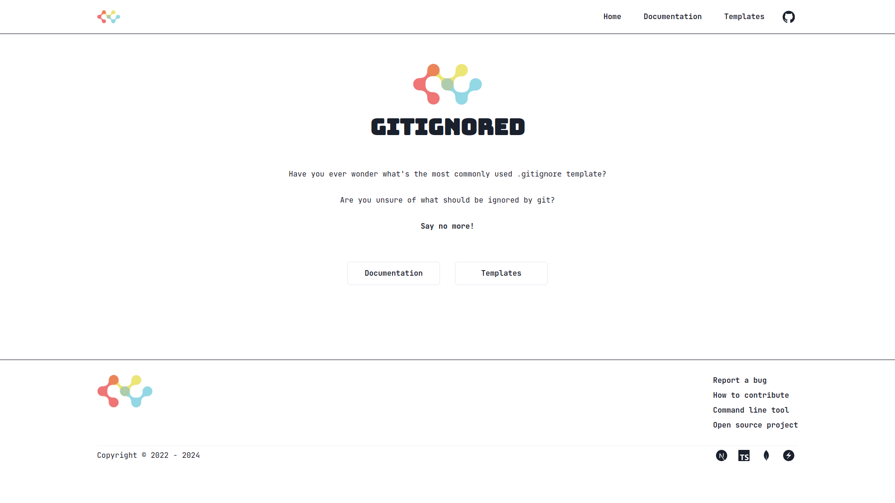
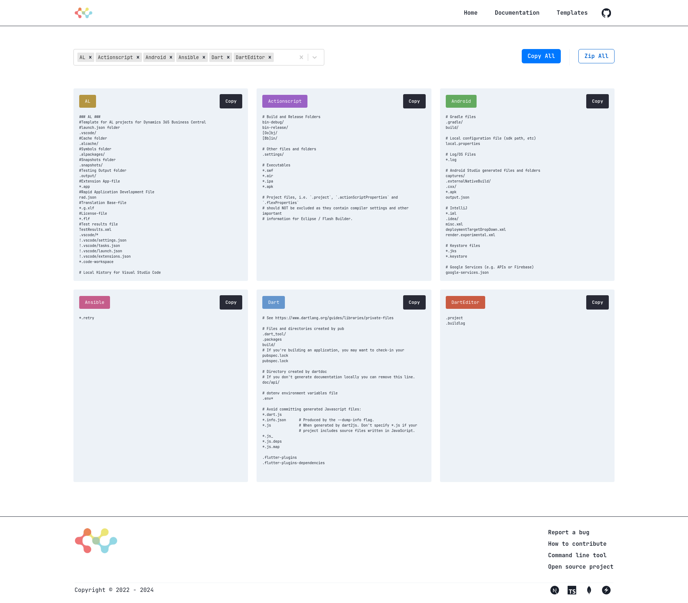
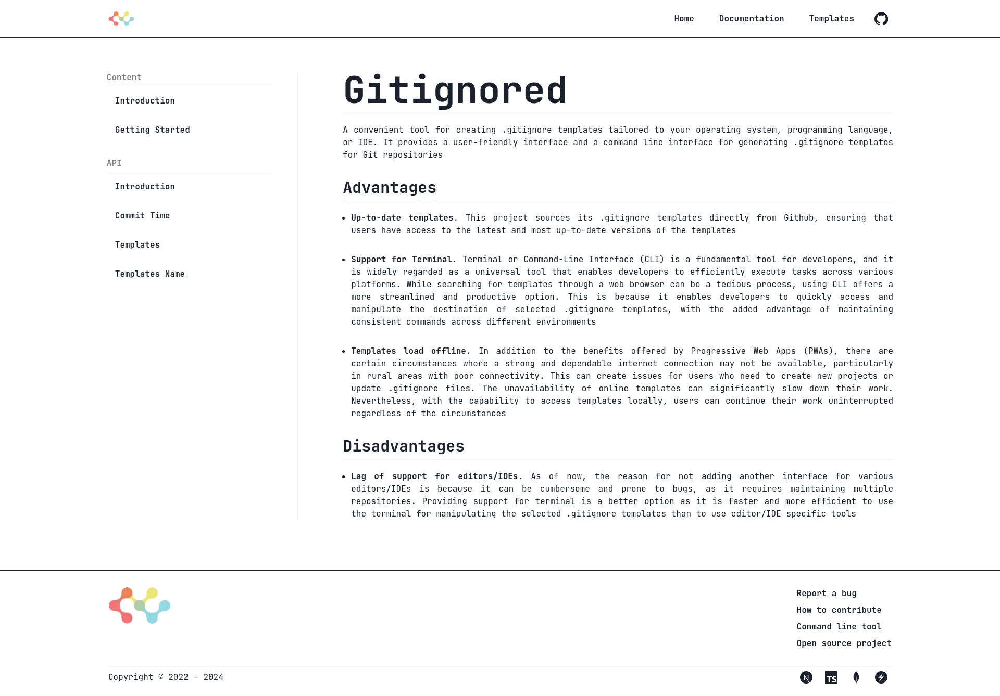
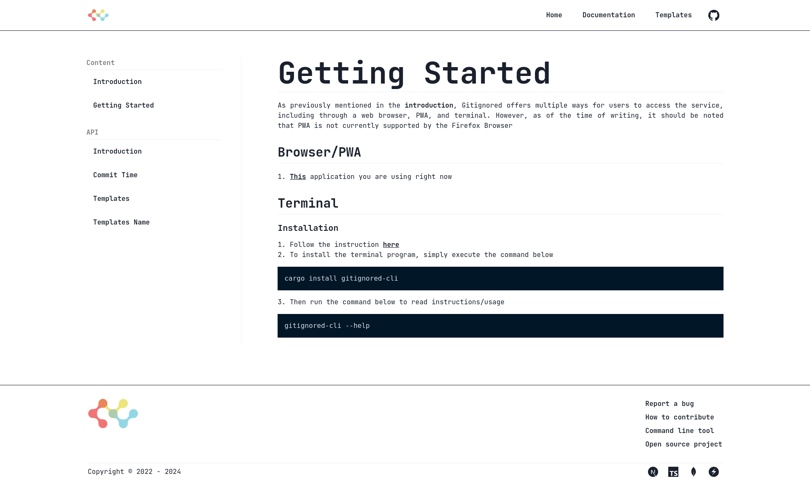
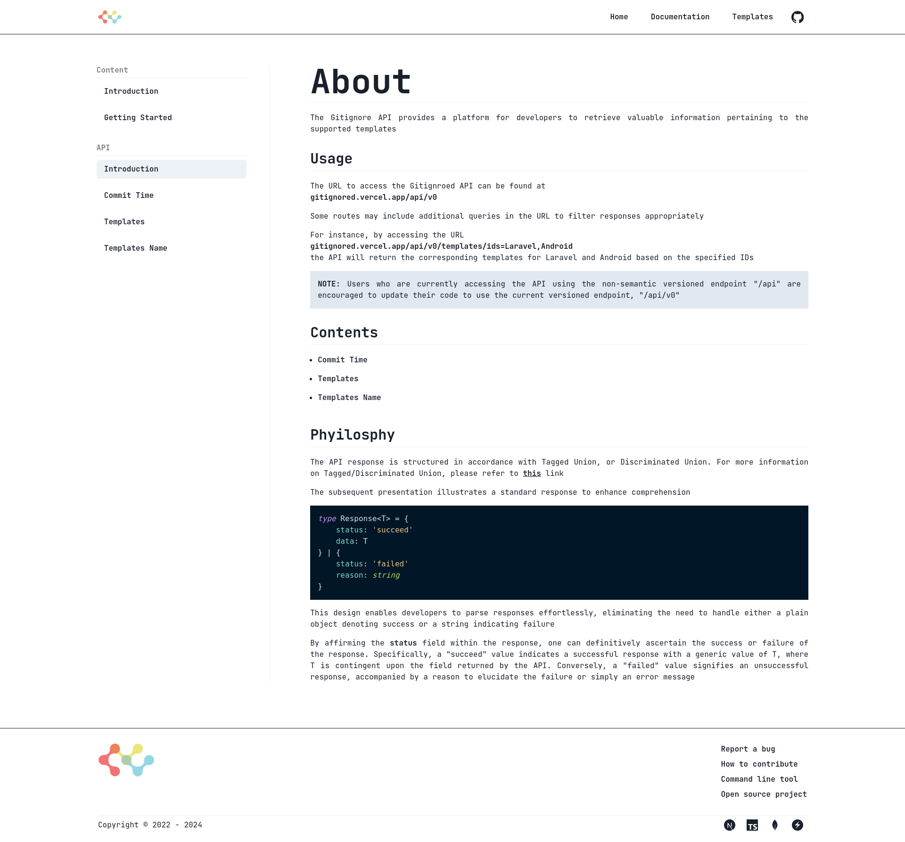
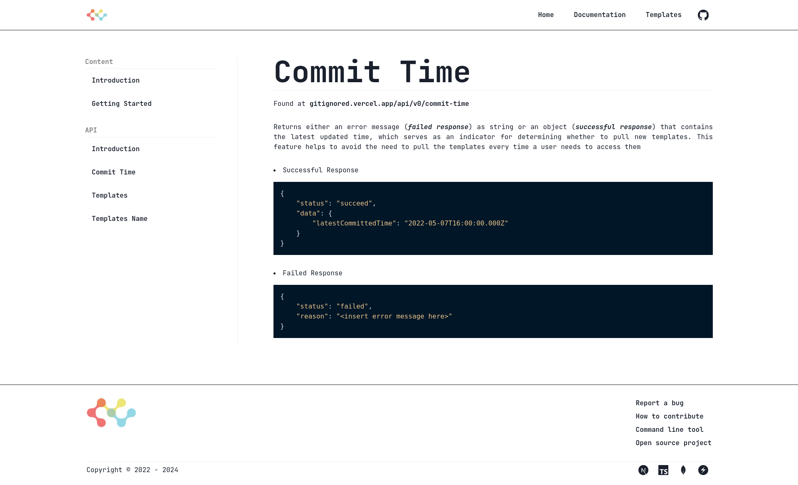
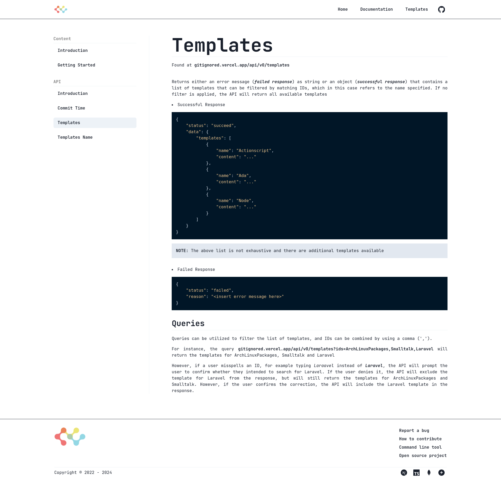
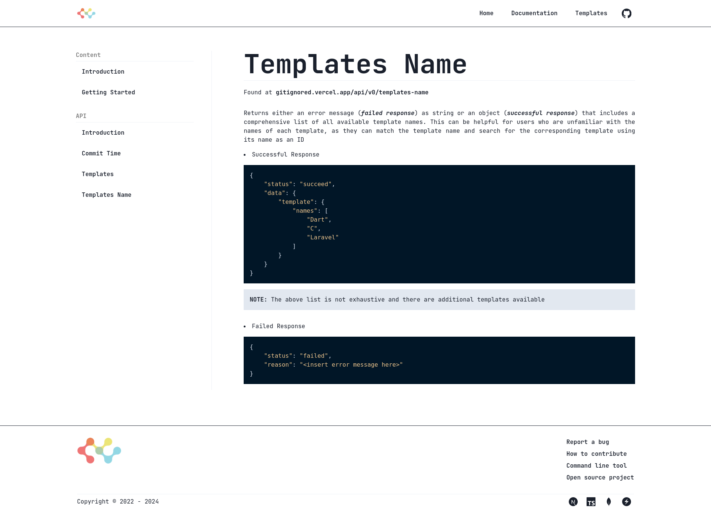
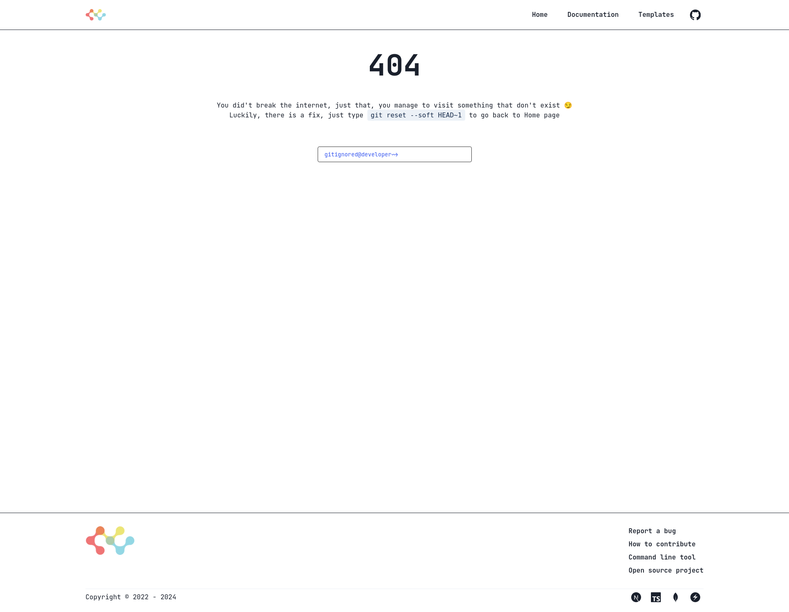

# **Gitignored**

## Web App

A web application that let the developer generate various `.gitignore` templates

The templates are taken from the repo [gitignore](https://github.com/github/gitignore) of GitHub. Hence the templates generated are reliable

Here's what the developers can do with it

1. Copy various templates as one or download as all into one zip
2. Copy each template without downloading any templates

#### Home Page



#### Templates



#### Docs Introduction



#### Docs Content



#### Docs API

##### Introduction



##### Commit Time



##### Templates



##### Templates Name



#### 404 Page



## Tech Used

| Aspect                                                                 | Name           |
| ---------------------------------------------------------------------- | -------------- |
| Development Language                                                   | TypeScipt      |
| Scripting Language                                                     | TypeScipt      |
| Testing                                                                | Vitest         |
| Styling                                                                | Chakra-UI      |
| Framework                                                              | NextJS         |
| Build Automation Tool                                                  | Make           |
| Text Editor                                                            | NeoVim         |
| Dependency Management                                                  | Pnpm           |
| Continuous Integration, Continuous Delivery, and Continuous Deployment | GitHub Actions |

#### Make Commands

_*Below are the non-exhaustive listed commands that you can use to build/develop/test this app. For more command, checkout [Makefile](./aakefile)*_

| Command                                                      | Usage                                             |
| ------------------------------------------------------------ | ------------------------------------------------- |
| make start-(development OR production OR testing OR staging) | Start development                                 |
| make build-(development OR production OR testing OR staging) | Bundle and build the app                          |
| make install                                                 | Install all dependencies                          |
| make test                                                    | Run all test code                                 |
| make typecheck                                               | Run typechecking for source code                  |
| make lint                                                    | Run linter for source and test code               |
| make format-check                                            | Run prettier to check source and test code format |
| make format                                                  | Run prettier to format source and test code       |
| make start-development-database                              | Start development database                        |
| make start-testing-database                                  | Start test database                               |

## Environment Variables

#### Development and Testing

Run the following command

`make copy-env-[development/testing]`

## Contribution

**Make sure you can run `make`, otherwise you need to run commands listed in `Makefile` separately**

1. Open an issue
1. Fork this repo
1. Use TypeScript
1. Write test

## Test

It's necessary to UI snapshot test, it's also a must to write test for logical processing functions

## Cli App

An Offline-first CLI application that let the developer generate various `.gitignore` templates

The templates are taken from the web application [Gitignored](https://gitignored.vercel.app), which is the GUI application of this application, check out the [repository](https://github.com/Gitignored-App/web) if you are interested

**Side note**:
The GUI application takes the templates from [gitignore](https://github.com/github/gitignore) of Github

Here's what the developers can do with this application

1. View the name of all available templates
2. Search to find out whether a name of a template exists
3. Preview each template(s) searched, it will include the closest template if there's typo in the name searched, i.e JetBrains for jetbrain
4. Generate template(s) to a `.gitignore` file, will not override current `.gitignore`, pass `-f` to forcefully override
5. Generate template(s) to a specified directory, i.e `temp/temp1`, it will auto generate at as `temp/temp1/.gitignore`
6. Append template(s) to an existing `.gitignore` file, it will create one if it does not exist
7. Append template(s) to an existing `.gitignore` file of a specified directory, again it will create one if it does not exist
8. Update the cache to receive latest templates

You don't need to have an internet connection to use it, unless you want to update the cache

**_Note: gitignored-cli is a work-in-progress library, so expect breaking changes in its API_**

#### Default or Help


#### Update Available


#### Default Listing


#### Listing with column number specified


#### Search


#### Preview


#### Default Generate


#### Force Generate


#### Generate with outdir specified


#### Default Append


#### Append with outdir specified


#### Updated Cache


#### Updating Cache


#### Of course, input validation


## How To Use

Install it

```sh
cargo install gitignored-cli
```

Run it

```sh
gitignored-cli (commands)
```

## Tech Used

| Aspect                                                                 | Name           |
| ---------------------------------------------------------------------- | -------------- |
| Language                                                               | Rust           |
| Linting                                                                | Clippy         |
| Format                                                                 | Rustfmt        |
| Build Automation Tool                                                  | Make           |
| Text Editor                                                            | NeoVim         |
| Package Manager                                                        | Cargo          |
| Continuous Integration, Continuous Delivery, and Continuous Deployment | GitHub Actions |

## Make Commands

_*Below are the listed commands that you can use to build/develop/test this app*_

| Command        | Usage                                           |
| -------------- | ----------------------------------------------- |
| make test-dev  | Run all test code in development environment    |
| make test-prod | Run all test code in ci-cd                      |
| make build     | Bundle, build and release the app as executable |
| make check     | Run compiler checking on code                   |
| make lint      | Run linter for code                             |
| make format    | Run formatter to format the code                |

## Development

**I used localhost instead of using the url of a production-ready web application to speed up development process as the API call can be processed much quicker**

1. Clone this [cli repo](https://github.com/Gitignored-App/cli) and this [web repo](https://github.com/Gitignored-App/web)
2. Refer to the commands specified in each Makefile

## Contribution

**Make sure you can run `make`, otherwise you need to run commands listed in `Makefile` separately**

1. Open an issue
2. Fork this repo and this [repo](https://github.com/Gitignored-App/cli)
3. Write test

## Changes

Refer to [here](https://github.com/Gitignored-App/cli/blob/main/CHANGELOG.md)
