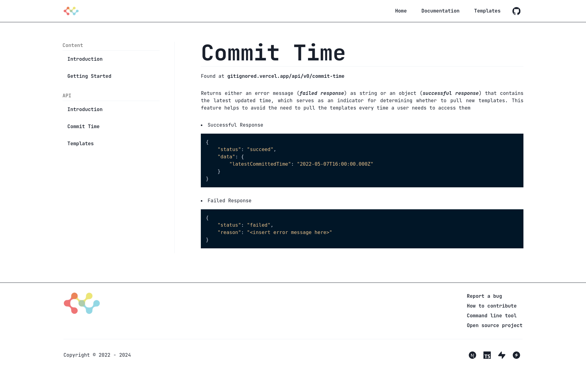
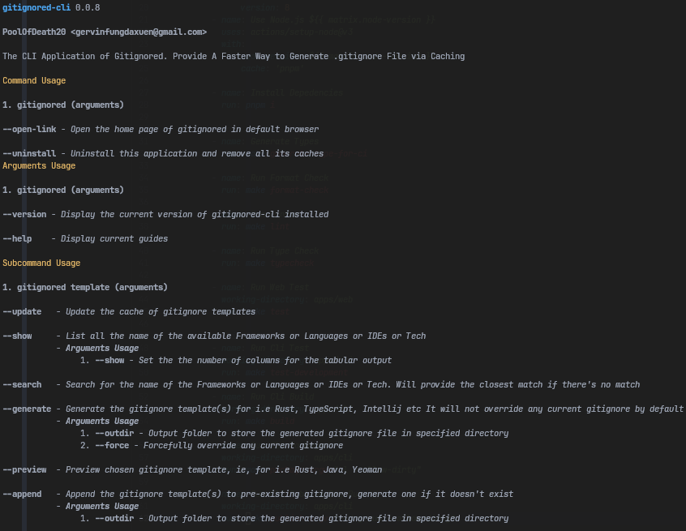
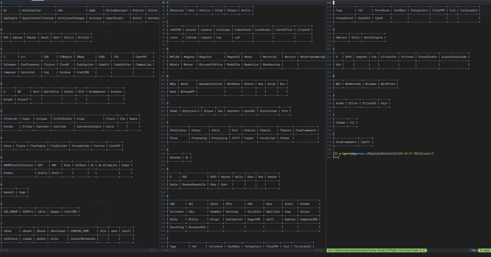
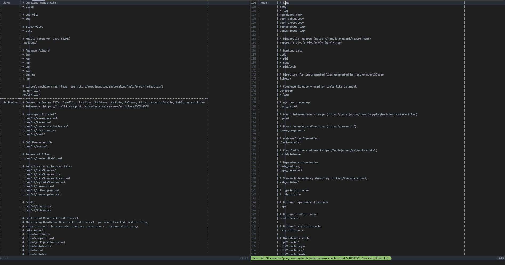
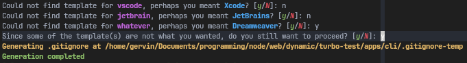
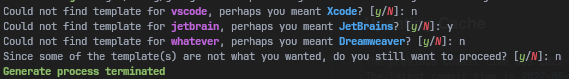
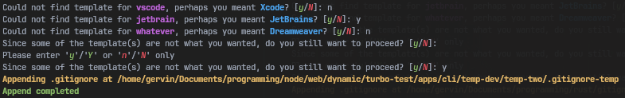
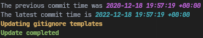
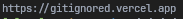
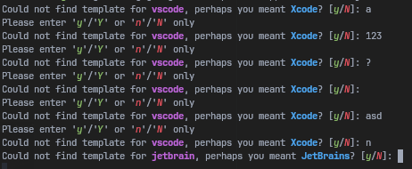

# Gitignored

<p align="center">
    
</p>

## Web App

A web application that let the developer generate various `.gitignore` templates, available [here](https://gitignored.vercel.app)

The templates are taken from the repo [gitignore](https://github.com/github/gitignore) of GitHub. Hence the templates generated are reliable

Here's what the developers can do with it

1. Copy various templates as one or download as all into one zip
2. Copy each template without downloading any templates

Home Page


Templates


Docs Introduction


Docs Content


Docs API

Introduction


Commit Time



Templates


404 Page


# Tech Used

| Aspect                 | Name           |
| ---------------------- | -------------- |
| Development Language   | TypeScipt      |
| Scripting Language     | TypeScipt      |
| Testing                | Vitest         |
| Styling                | Chakra-UI      |
| Framework              | NextJS         |
| Build Automation Tool  | Make           |
| Dependency Management  | Pnpm           |
| Continuous Integration | GitHub Actions |

# Make Commands

_*Below are the non-exhaustive listed commands that you can use to build/develop/test this app. For more command, checkout [Makefile](apps/web/Makefile)*_

| Command                                                      | Usage                                             |
| ------------------------------------------------------------ | ------------------------------------------------- |
| make start-(development OR production OR testing OR staging) | Start development                                 |
| make build-(development OR production OR testing OR staging) | Bundle and build the app                          |
| make install                                                 | Install all dependencies                          |
| make test                                                    | Run all test code                                 |
| make typecheck                                               | Run typechecking for source code                  |
| make lint                                                    | Run linter for source and test code               |
| make format-check                                            | Run prettier to check source and test code format |
| make format                                                  | Run prettier to format source and test code       |
| make start-(development OR testing)-database                 | Start database                                    |
| make copy-env-(development OR testing)                       | Copy environment variables                        |

# Test

It's necessary to UI snapshot test, it's also a must to write test for logical processing functions

# Cli App

An Offline-first CLI application that let the developer generate various `.gitignore` templates

The templates are taken from the web application [Gitignored](https://gitignored.vercel.app), which is the GUI application of this application. The TUI application is available [here](https://crates.io/crates/gitignored-cli)

**Side note**:
The GUI application takes the templates from [gitignore](https://github.com/github/gitignore) of Github

Here's what the developers can do with this application

1. View the name of all available templates
2. Search to find out whether a name of a template exists
3. Preview each template(s) searched, it will include the closest template if there's typo in the name searched, i.e JetBrains for jetbrain
4. Generate template(s) to a `.gitignore` file, will not override current `.gitignore`, pass `--force` to forcefully override
5. Generate template(s) to a specified directory, i.e `temp/temp1`, it will auto generate at as `temp/temp1/.gitignore`
6. Append template(s) to an existing `.gitignore` file, it will create one if it does not exist
7. Append template(s) to an existing `.gitignore` file of a specified directory, again it will create one if it does not exist
8. Update the cache to receive latest templates
9. Uninstall and remove every cache
10. Open home page/website of this application

You don't need to have an internet connection to use it, unless you want to update the cache

**_Note: gitignored-cli is a work-in-progress library, so expect breaking changes in its API_**

# Default or Help

```sh
gitignored-cli
```

OR

```sh
gitignored-cli --help
```



# Update Available


# Default Listing

```sh
gitignored-cli template --list
```


# Listing with column number specified

```sh
gitignored-cli template --list --column 8
```



# Search

```sh
gitignored-cli template --search rust node java vscode jetbrain whatever
```


# Preview

```sh
gitignored-cli template --preview rust node java vscode jetbrain
```



# Default Generate

```sh
gitignored-cli template --generate rust node java vscode jetbrain whatever
```




# Abort Generate

```sh
gitignored-cli template --generate rust node java vscode jetbrain whatever
```



# Force Generate

```sh
gitignored-cli template --generate rust node java vscode jetbrain whatever --force
```


# Generate with outdir specified

```sh
gitignored-cli template --generate rust node java vscode jetbrain whatever --outdir temp-dev/temp-two
```


# Default Append

```sh
gitignored-cli template --append rust node java vscode jetbrain whatever
```


# Abort Append

```sh
gitignored-cli template --append rust node java vscode jetbrain whatever
```


# Append with outdir specified

```sh
gitignored-cli template --append rust node java vscode jetbrain whatever --outdir temp-dev/temp-two
```



# Updated Cache

```sh
gitignored-cli template --update
```


# Updating Cache

```sh
gitignored-cli template --update
```



# Open home page in browser

```sh
gitignored-cli open-link
```



# Uninstall

```sh
gitignored-cli uninstall
```


# Of course, input validation



# How To Use

Install it

```sh
cargo install gitignored-cli
```

Run it

```sh
gitignored-cli (commands)
```

### Tech Used

| Aspect                 | Name           |
| ---------------------- | -------------- |
| Language               | Rust           |
| Linting                | Clippy         |
| Format                 | Rustfmt        |
| Build Automation Tool  | Make           |
| Package Manager        | Cargo          |
| Continuous Integration | GitHub Actions |

### Make Commands

_*Below are the listed commands that you can use to build/develop/test this app*_

| Command        | Usage                                           |
| -------------- | ----------------------------------------------- |
| make test-dev  | Run all test code in development environment    |
| make test-prod | Run all test code in ci-cd                      |
| make build     | Bundle, build and release the app as executable |
| make check     | Run compiler checking on code                   |
| make lint      | Run linter for code                             |
| make format    | Run formatter to format the code                |

### Contribution

**Make sure you can run `make`, otherwise you need to run commands listed in `Makefile` separately**

1. Open an issue
2. Fork this repo
3. Write test

### Changes

Refer to [here](apps/cli/CHANGELOG.md)
